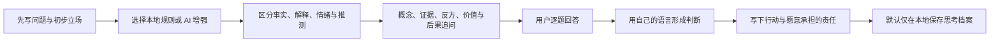

<div align="center">
  <a href="https://sirugao.github.io/socratic-kernel/">
    
  </a>

  <h1>Socratic Kernel · 内核</h1>

  <p><strong>一个不替你做决定的认知自主权练习应用。</strong></p>
  <p>先写下自己的立场，再审查前提、证据、反方、价值与责任。</p>

  <p>
    <a href="https://sirugao.github.io/socratic-kernel/"><strong>体验本地版</strong></a>
    ·
    <a href="./docs/AI_GATEWAY.md">接入大模型</a>
    ·
    <a href="./docs/APP_ARCHITECTURE.md">App 路线</a>
    ·
    <a href="./docs/PRODUCT.md">产品原则</a>
    ·
    <a href="./README_EN.md">English</a>
  </p>

  <p>
    <a href="https://github.com/SiruGao/socratic-kernel/actions/workflows/deploy-kernel-pages.yml"></a>
    <a href="https://github.com/SiruGao/socratic-kernel/stargazers"></a>
    <a href="https://github.com/SiruGao/socratic-kernel/commits/main"></a>
    
    
    
    
  </p>
</div>

> [!IMPORTANT]
> **当前是早期 MVP。** 本地规则引擎始终可用；AI 增强必须由用户主动开启，并通过服务端网关调用。系统不声称能够诊断人格或心理状态，也不会替用户形成最终人生结论。

<p align="center">
  
</p>

## 为什么需要它

生成式 AI 让答案变得即时、完整而廉价，但也容易让人把问题定义、价值排序和最终判断一并外包。

Socratic Kernel 不反对使用 AI。它关心的是：

- 哪些任务适合交给工具；
- 哪些判断必须由人亲自形成；
- 语言流畅是否正在被误认为证据充分；
- 一次对话结束后，责任是否真正回到了用户手中。

| 普通 AI 助手 | Socratic Kernel |
| --- | --- |
| 尽快给出答案 | 要求用户先写下初步立场 |
| 降低所有认知摩擦 | 只在价值判断和推理缺口处制造必要摩擦 |
| 优化满意度与对话时长 | 优化独立判断、反例意识和责任承担 |
| 记住偏好以提高便利 | 记录思考线索，但允许查看、导出和删除 |
| 可能强化既有叙事 | 主动检验确认偏误、流畅性信任和判断外包 |

## 它如何工作



### 审议流程

1. **先行立场**：在看到系统分析之前，用户先写下问题、立场、依据和确信程度。
2. **选择引擎**：使用透明的本地规则，或主动选择服务端 AI 生成更贴合语境的问题。
3. **结构化追问**：问题覆盖概念、证据、可证伪性、最强反方、价值来源、长期后果和责任归属。
4. **判断归还**：系统不生成最终人生结论，用户必须亲自写下暂时判断。
5. **现实检验**：每次审议以最小行动和愿意承担的代价结束。

## 五种核心模式

| 模式 | 适用场景 | 主要检验 |
| --- | --- | --- |
| **决策审议** | 选择项目、工作、关系或行动方向 | 标准冲突、长期代价、可逆实验 |
| **观点审查** | 检查一个自己确信的主张 | 证据、可证伪性、最强反方 |
| **阅读质疑** | 分析文章、网页、报告或他人论证 | 隐藏前提、框架遗漏、引用责任 |
| **自我反思** | 理解欲望、焦虑与重复行为模式 | 欲望来源、身份压力、现实验证 |
| **AI 使用审计** | 在向 AI 外包任务或判断之前 | 认知分工、接受条件、独立核验 |

## 当前能力

- 五种结构化审议模式；
- 首次访问引导与三个可编辑示例；
- 本地认知线索检测和离线追问；
- 可选的多供应商 AI 追问网关；
- 支持 OpenAI、Claude、Gemini、DeepSeek、Qwen、Kimi 和 Grok；
- AI 失败时自动保留本地追问；
- 审议前后确信程度对比；
- 最终判断、行动和责任确认；
- 长期思考档案与重复线索统计；
- 单条删除、全部删除、JSON 导入与导出；
- PWA 安装与离线使用；
- Pull Request 自动测试与构建。

## 隐私不是设置，而是架构

思考档案默认保存在当前浏览器的 `LocalStorage` 中。不开启 AI 时，问题、回答和档案不会发送到服务器。

开启 AI 增强时，只发送本次审议所需的最小字段：当前问题、问题类型、初始立场、依据、确信度和挑战强度。

- **密钥在服务端**：供应商 API Key 不进入浏览器、PWA 或未来安装包；
- **主动开启**：AI 模式默认关闭，用户可逐次选择本地或 AI 引擎；
- **最小发送**：默认不发送历史档案、其他回答和长期模式统计；
- **失败回退**：供应商超时、拒绝或格式异常时继续使用本地问题；
- **不画像**：没有广告追踪、行为分析或隐藏人格评分；
- **可迁移**：可以导出完整 JSON 档案并在其他浏览器导入；
- **可撤回**：支持删除单条记录或永久删除全部数据。

> [!NOTE]
> 清除浏览器站点数据会删除本地档案。重要记录请先使用应用中的“导出档案”。模型供应商可能有各自的数据处理政策，公开发布前应向用户明确展示所选供应商。

## 快速开始

### 在线使用本地版

访问：**[sirugao.github.io/socratic-kernel](https://sirugao.github.io/socratic-kernel/)**

GitHub Pages 版本提供完整本地规则、档案和 PWA 能力，但不托管服务端模型密钥。

### 本地规则模式

```bash
git clone https://github.com/SiruGao/socratic-kernel.git
cd socratic-kernel
python3 -m http.server 4173
```

打开 `http://localhost:4173`。

### AI 网关模式

```bash
cp .env.example .env.local
# 在 .env.local 中至少配置一个供应商 API Key
npx vercel dev
```

然后打开 Vercel CLI 提供的本地地址，进入“模型”页面检查网关。完整说明见 [`docs/AI_GATEWAY.md`](./docs/AI_GATEWAY.md)。

### 测试与构建

```bash
npm test
npm run build
```

构建产物位于 `dist/`。GitHub Pages 部署纯本地版；Vercel 同时部署静态前端和 `/api` Serverless Functions。

## 技术架构

| 层 | 实现 | 职责 |
| --- | --- | --- |
| 应用壳 | `index.html` + `styles.css` + `ai.css` | 响应式界面与无障碍结构 |
| 本地审议引擎 | `app.js` | 状态管理、线索检测、问题编排和流程控制 |
| 首次体验 | `onboarding.js` | 引导、示例和首次四问流程 |
| AI 客户端 | `ai.js` | 模型设置、用户同意、调用和本地回退 |
| 模型网关 | `api/` + `lib/ai-gateway.js` | 服务端密钥、供应商适配和结构化输出 |
| 本地记忆 | `LocalStorage` | 保存审议、信心变化和模型元数据 |
| 离线能力 | `manifest.webmanifest` + `sw.js` | PWA 安装和静态资源缓存 |
| 质量门禁 | Node tests + GitHub Actions | 语法、隐私边界、网关适配和构建验证 |

更完整的设计见 [`docs/ARCHITECTURE.md`](./docs/ARCHITECTURE.md)、[`docs/AI_GATEWAY.md`](./docs/AI_GATEWAY.md) 和 [`docs/APP_ARCHITECTURE.md`](./docs/APP_ARCHITECTURE.md)。

## 路线图

- [x] 本地优先的结构化审议闭环
- [x] 首次访问引导和一键示例
- [x] AI 使用审计
- [x] 思考档案、导入导出与删除
- [x] PWA 与离线能力
- [x] 多供应商服务端模型网关
- [ ] 账号、订阅额度、限流和成本控制
- [ ] Chrome / Edge / Firefox 浏览器扩展
- [ ] 独立的反迎合审查器
- [ ] Tauri 桌面应用与 Capacitor 移动应用
- [ ] 可追溯的哲学原典知识层
- [ ] 用户可编辑的个人认知模型
- [ ] 独立性指标与长期效果研究

详细计划见 [`docs/ROADMAP.md`](./docs/ROADMAP.md)。

## 项目文档

| 文档 | 内容 |
| --- | --- |
| [`PRODUCT.md`](./docs/PRODUCT.md) | 产品使命、不可妥协原则与边界 |
| [`ARCHITECTURE.md`](./docs/ARCHITECTURE.md) | 当前架构和未来分层架构 |
| [`AI_GATEWAY.md`](./docs/AI_GATEWAY.md) | 七家模型供应商、Vercel 和安全配置 |
| [`APP_ARCHITECTURE.md`](./docs/APP_ARCHITECTURE.md) | Web、桌面、iOS 和 Android 共享路线 |
| [`GROWTH.md`](./docs/GROWTH.md) | 订阅、留存和公开发布策略 |
| [`ROADMAP.md`](./docs/ROADMAP.md) | 模型层、浏览器扩展、App 和认知模型计划 |
| [`CONTRIBUTING.md`](./CONTRIBUTING.md) | 开发流程、提交标准和设计约束 |
| [`SECURITY.md`](./SECURITY.md) | 隐私问题与安全漏洞报告方式 |

## 参与贡献

这个项目欢迎以下类型的贡献：

- 更准确、不过度的苏格拉底式问题协议；
- 反迎合与判断外包测试案例；
- 模型供应商适配和故障回退；
- 无障碍、移动端和本地化改进；
- 浏览器扩展与隐私威胁模型；
- 关于“AI 是否增强了用户独立判断”的评估方法。

开始前请阅读 [`CONTRIBUTING.md`](./CONTRIBUTING.md)。较大的功能建议先通过 [Feature Request](https://github.com/SiruGao/socratic-kernel/issues/new?template=feature_request.yml) 讨论。

## 产品边界

Socratic Kernel 不是心理治疗工具，也不替代医疗、法律、财务或其他专业意见。它不会因为识别到某种语言模式，就断言用户具有某种人格或心理状态。所有“线索”都只是需要用户继续核验的假设。

## License

本项目采用 [MIT License](./LICENSE)。

---

<div align="center">
  <strong>一个好的 AI 苏格拉底，不应让人永久依赖它。</strong><br />
  它的目标，是让用户逐渐能够在没有它时继续追问、判断与承担。
</div>
